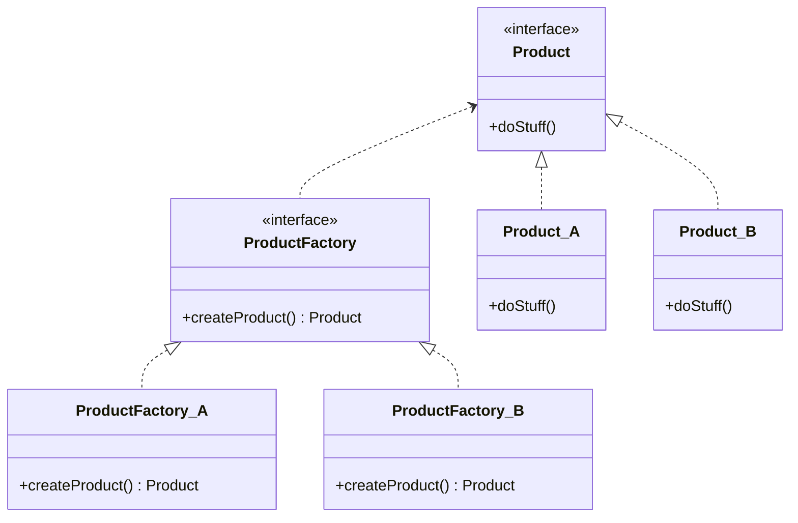

The factory method is a **creational pattern** which gives an interface for creating subclasses.
This post will demonstrate a classical OOP pattern and a more pythonic factory pattern.

<!--truncate-->

## What is Factory Method Pattern?

Factory method pattern is a creational design pattern that provides a high-level interface for creating a superclass object
but allows subclasses to alter the type of objects created. Following is a high-level overview of the patterns:

1. Define a superclass/interface of the subclasses.
2. Define an abstract method for creating a superclass object.
3. Each subclass implements the creation method above.
4. Program can alter the subclass object by altering the factory method.

## Why do we Need Factory Pattern?

Suppose we want to change the structure of a class. If we add a member variable, we will likely add an additional argument for the `__init__()` function.
In most cases, **the creation process of an object is tightly coupled with the structure of the class**.
This means that your program should depend on the concrete implementation, although you programmed based on an abstract interface.
Therefore, you want to separate the use from the creation.

## Python Examples

### Original Code

The example is code for logging a scalar value.
Users can select which logger to use between 'tensorboard' and 'wandb'.
In the original code, I introduced an abstract superclass `Logger.`
However, the `main()` function is still coupled with two concrete classes, `TensorboardLogger` and `WandbLogger`, in the conditional branches.


```python
from abc import ABC, abstractmethod

class Logger(ABC):
	@abstractmethod
	def log_scalar(self, value: float) -> None:
		...

class TensorboardLogger(Logger):
	...

class WandbLogger(Logger):
	...

def main() -> None:
	# select logger type
	logger_name = input("Enter logger type (tensorboard, wandb)")

	# initialize logger
	logger: Logger
	if logger_name == "tensorboard":
		logger = TensorboardLogger()
	elif logger_name == "wandb":
		logger = WandbLogger()
	else
		raise ValueError

	# log experiments
	logger.log_scalar(0.5)
```

### Factory Pattern using Superclass

Let's define a corresponding factory interface and implement concrete factory classes for each logger.
In this implementation, `main()` function is unaware of how to create concrete classes.
It relies on abstract interfaces for both use and creation.

If you want to change the structure of a logger, it is enough to change the creation logic in its factory without modifying the `main()` function.

```python
class LoggerFactory(ABC):
	@abstractmethod
	def get_logger(self) -> Logger:
		...

class TensorboardLoggerFactory(ABC)
	def get_logger(self) -> Logger:
		return TensorboardLogger()

class WandbLoggerFactory(ABC):
	def get_logger(self) -> Logger:
		return WandbLogger()

def read_logger() -> LoggerFactory
	factories = {
		"tensorboard": TensorboardLoggerFactory(),
		"wandb": WandbLoggerFactory()
	}

	# select logger type
	logger_name = input("Enter logger type (tensorboard, wandb)")

	if logger_name in factories:
		return factories[logger_name]
	raise Exception("Unknown logger type")

def main() -> None:
	fac = read_logger()
	logger = fac.get_logger()
	logger.log_scalar(0.5)
```

### Factory Pattern using Protocol

Inheriting abstract classes introduces additional complexity, which comes from the class hierarchy. 
If the subclass does not reuse the parent's code and does not require a strict class hierarchy, it is preferable to use 'duck typing' rather than an abstract base class.
However, the factory pattern relies on abstract base classes because classical programming languages do not support 'duck typing.'
Python provides the `typing.Protocol` class for duck typing, so we can rewrite the code as follows.

```python
from typing import Protocol

class Logger(Protocol):
	def log_scalar(self, value: float) -> None:
		...

class TensorboardLogger:
	def log_scalar(self, value: float) -> None:
		...

class WandbLogger:
	def log_scalar(self, value: float) -> None:
		...

FACTORIES: dict[str, type[Logger]] = {
	"tensorboard": TensorboardLogger,
	"wandb": WandbLogger
}

def read_logger() -> Logger
	while True:
		# select logger type
		logger_name = input("Enter logger type (tensorboard, wandb)")
		try:
			logger_class = factories[logger_name]
			return logger_class()
		except KeyError:
			print("Unknown logger type.")

def main() -> None:
	logger = read_logger()

	# log experiments
	logger.log_scalar(0.5)
```

## Class Diagram

